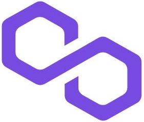

# POLYLEMMA

Commit-Reveal Scheme を応用したフルオンチェーンPvPコマンドバトルゲーム

## プロダクト概要
GameFi では Earn できることからそのエコシステムがゲーム内に閉じておらず、外の世界に影響が伝播する。故にゲームの都合だけで状態を巻き戻すことが困難なため、普通のゲーム以上に不正や改竄の検知が重要になる。そのためフルオンチェーンでゲームを行いたいが、ブロックチェーンの公開台帳的な性質によって得られる”透明性”と情報を完全に公開しないことでゲームの面白さを引き出す”表現力”のトレードオフが発生する。オンチェーンに載せるという制約によってゲーム内で実現できる表現の幅が狭まり、ゲームの面白みが失われる可能性があるのだ。

今回我々はフルオンチェーンでも表現力を担保するために、Commit-Reveal Scheme を応用した新しいプロトコルを考案した。そしてこのプロトコルを用いて“同時に出す”、”隠す”という要素を盛り込んだフルオンチェーンPvPコマンドカードバトルゲームPOLYLEMMAを開発した。このプロトコルは GameFi に限らず、オンチェーンにおける改竄耐性や不正検知能力といった”透明性”の高さを生かしつつ、同時に”表現力”も保ちたい幅広い場面に応用できるプロトタイプとなっている。

## 特に読んでいただきたいアピールポイント
- 「Commit-Reveal Schemeを用いてオンチェーンで同期を実現したコマンドバトル」の解説は[こちら](docs/readme/37_command.md)。
- 「Commit-Reveal Scheme を応用した新しいプロトコル」の解説は[こちら](docs/readme/38_randomslot.md)。
  
上記アイデアの元となっているCommit-Reveal Schemeのわかりやすい解説は[こちら](docs/readme/21_commit-reveal.md)。Commit-Reveal Schemeをご存知でない方はまずはこちらをお読みいただきたいです。

(プロダクト全貌は[以下の詳細](#プロダクト詳細目次)にて解説しています。)
## 使用したチェーン
Mumbai Testnet

## コントラクトアドレス
- PLMCoin contract: "0xA0dcb1F996CB1335D4356C944C7168EE75a94953"
- PLMToken contract: "0xCF8D3345dd90B218b9F428562fe5985dC4AcDd56"
- PLMDealer contract: "0x38CE8D774a9fcb04Fa9AfeE5B0d0B82B7824857f"
- PLMMatchOrganizer contract: "0xD60a1442Fd07b45f8161515A3E8f392DdcCD1661"
- PLMBattleField contract: "0xa8F64D2Cd2F0597B586BFcfc940a49C9f2ea1247"

## OpenSea
ガチャでゲットしたキャラクターを確認できます！
https://testnets.opensea.io/collection/polylemma-v4

## 使っている技術スタック

Solidity, Foundry, Anvil, Cast, NodeJS, EtherJS, React

## 主な開発分担

- バックエンドの開発
  - [Kosei Teramoto](https://github.com/terapoon) (terapoon) 
  - [Shue Shiinoki](https://github.com/shiinokinoki) (nokinoki)

- フロントエンドの開発
  - [Nobuho Hashimoto](https://github.com/hashi0203) (hassy)
  - [Atsushi Kato](https://github.com/katoatsushi) (a_kato)

## プロダクト詳細目次
こちらの順で読んでいただくことで、プロダクトの全貌が理解しやすくなっておりますが、本プロジェクトの肝である新しいプロトコルに関する解説はバトルシステム以降で説明しております。
- 前提知識
  - [Commit-Reveal Scheme とは](./docs/readme/21_commit-reveal.md)
- ゲームの要素とその実現方法について
  - [キャラクター (PLMToken / ERC721)](./docs/readme/31_character.md)
  - [ゲーム内通貨 (PLMCoin/ ERC20) とトークノミクス](./docs/readme/32_coin.md)
  - [公式ミントであることが証明されるガチャ](./docs/readme/33_gacha.md)
  - [ガス代を削減した実装：スタミナ/サブスクリプション](./docs/readme/34_stamina.md)
  - ["decentrarized autonomous" マッチメイキング](./docs/readme/35_matchmaking.md)
- バトルシステム
  - [バトルシステム概要](./docs/readme/36_battlesystem.md)
  - [Commit-Reveal Schemeを用いてオンチェーンで同期を実現したコマンドバトル](./docs/readme/37_command.md)
  - [考案したプロトコルを使用した"ランダムスロット"](./docs/readme/38_randomslot.md)
  - [バトル報酬](./docs/imgs/../readme/39_reward.md)

## プロダクトテスト方法
  本レポジトリはゲーム本体であるスマートコントラクトが格納されています。
  
  ゲームをプレイするためのクライアント用ソフトウェアは下記の我々が作成した別レポジトリに格納されています。
  
  スマートコントラクトは既にmumbai testnetにデプロイされており、この別リポジトリにあるクライアントソフトウェアを使用することでスマートコントラクトとやりとりしてゲームをプレイすることが可能です。

  クライアントインストール方法もそちらのREADMEにありますので、ご確認ください。

  https://github.com/team-tissis/polylemma-client/

## アーキテクチャ
スマートコントラクト同士の関係図。矢印はどのような操作を依頼するかを表している。

