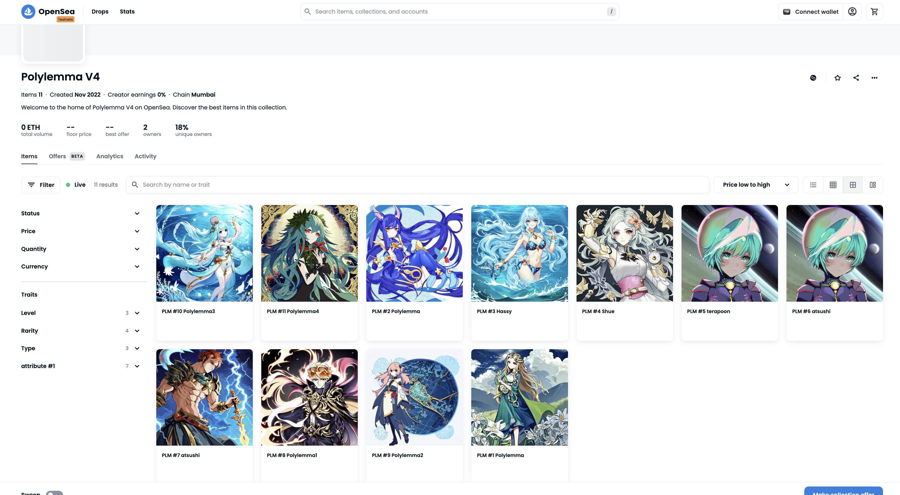

# POLYLEMMA
Commit-Reveal Schemeを応用したフルオンチェーンPvPコマンドバトルゲーム
> written by @terapoon powered by chatGPT 4

## 『戦略と駆け引きで勝利をつかめ！ブロックチェーン技術による革新的バトルゲーム』

> generated by @terapoon using Stable Diffusion

## 概要
Polylemmaは、commit-reveal schemeを応用したフルオンチェーンPvPコマンドゲームバトルです。ゲーム内のモンスターはNFT（非代替性トークン）として発行され、独自性と所有権が保証されます。プレイヤーは戦略的なバトルを繰り広げながら、個性豊かなNFTモンスターを収集・育成し、独自のモンスターチームを構築します。ゲームのサブスクリプション管理、バトルマッチング、スタミナ管理など全てが自動で（非中央集権的に）実装されており、誰かが管理する必要がありません。また、決められたルール違反が検出された場合、自動的にプレイヤーのサブスク期間が減らされる罰則（BAN）が適用されます。

### キャラクターは NFT の出品サイト (OpenSea) 上でも閲覧可能です↓↓↓↓
※ テストネットというテスト用のブロックチェーン上にデプロイしたものなので現実的な価値はありません。

> character images are generated by @terapoon using Stable Diffusion

## ゲームの魅力
1. Commit-reveal schemeによる独特なゲームプレイ
2. モンスターの属性と特性を活用した戦略的なバトル
3. レベルポイント制度による戦術の幅の拡大
4. NFTモンスターによる独自性と所有権の保証
5. 非中央集権的なゲーム管理と自動化
6. ルール違反に対する自動的な罰則（BAN）システム
7. オンチェーン技術を活用した分散型アプリケーションの実践

POLYLEMMAは、ブロックチェーン技術とcommit-reveal schemeを活用した革新的なオンチェーンPvPコマンドゲームバトルです。戦略性と駆け引きが交錯する独自のゲーム体験を提供し、非中央集権的なゲーム管理と自動化により、プレイヤーが安心して楽しむことができます。

このプレスリリースの内容は、一般的なゲームファンからブロックチェーン技術に興味のある方まで幅広く魅力的であることを目指しております。Polylemmaは、戦略的なバトルを繰り広げることができ、NFTモンスターを収集・育成しながら独自のモンスターチームを構築できます。非中央集権的なゲーム管理や自動化により、プレイヤーはゲームをスムーズに楽しむことができます。

まだ未体験の方も、この機会にcommit-reveal schemeを応用したフルオンチェーンPvPコマンドゲームバトル、POLYLEMMAに挑戦してみてはいかがでしょうか。戦略と駆け引きの世界で、あなたのスキルを試し、勝利をつかみ取ろう！

どうぞ、ご興味を持たれましたら、POLYLEMMAをお試しください。今回のプロトタイプが提供する革新的なゲーム体験をぜひお楽しみください。