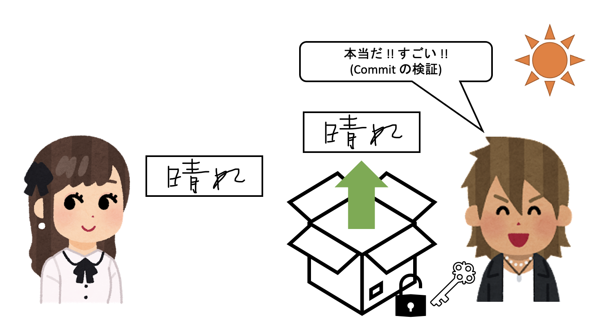

前提知識

 < [HOMEに戻る](../../README.md)   >
___

# Commit-Reveal Scheme とは

Commit-Reveal Scheme とは暗号プロトコルの一つで、POLYLEMMA のコアとなる技術です。ここでは、簡単な例を用いながら、Commit-Reveal Scheme とは何かを解説します。

## Commit-Reveal Scheme 解説 

Alice と Bob がいて、Bob が明日の天気を予想するように Alice に言ったとします。すぐにいうと面白くないので、アリスは晴れであると予想はしますが、Bob には言いません。

ただし、予想をしたという証拠は残したいので、Alice は自分の予想を秘密のメッセージとして紙にかき、これを箱に入れて鍵をかけます。厳密には、これはハッシュ関数で暗号化することに対応しています。この鍵をかける操作のことを Commit とよび、箱のことを Commit String などと言います。箱は Bob に送られます。

箱は Alice しか持っていない鍵でロックされているため、Bob は箱の中身を見ることができず、Alice が明日の天気を何だと予想したのか知る術を持ちません。この性質のことを、Hiding と言います。厳密には、ハッシュの原像計算困難性により担保されています。原像計算困難性とは、ハッシュ関数で暗号化された暗号文を見て、ハッシュ関数の入力である秘密のメッセージを当てることが現実的な時間では困難であるという性質です。

では、Alice は後から予想を覆すことができるでしょうか？答えは No です。箱はすでに Bob の手中にあるため Alice は後から予想を晴れから雨に変更することはできません。この性質のことを Binding と言います。厳密には、ハッシュの第２原像計算困難性により担保されています。第２原像計算困難性とは、ハッシュ関数で暗号化された暗号文と、ハッシュ関数にかけられる前の秘密のメッセージを見て、別の秘密のメッセージで、ハッシュ関数をかけると同じ暗号文が作られるようなものを見つけることが現実的な時間では困難であるという性質です。この性質は弱衝突困難性とも言われており、もし Alice が雨に予想を変えていた場合は異なる暗号文が作られるので、予想を変えたことがバレてしまいます。

さて、次の日になりました。天気は晴れです。Alice の予想は的中しました。あとは、Alice が自分が昨日、今日の天気が晴れであるとあらかじめ予想していたことを証明する必要があります。証明方法は簡単です。Alice は箱に入れた暗号文と、箱をロックした鍵を Bob に渡します。

Bob は送られてきた鍵で箱を開けて、出てきた秘密のメッセージが、Alice が申告してきたものと一致することを確認し、確かに Alice が昨日の時点で今日の天気が晴れであると予想していたということを検証できました。より深く理解したい方のために正確な説明を添えると、実は上の説明は不正確で、実際には送られてきた鍵と秘密のメッセージを用いて Bob も箱を作ってロックし、それらが全く同じものであることを持って検証を行います。つまり、Alice と同じ手順を辿ってハッシュ関数を計算し、暗号文を作って Commit で送られてきていた暗号文と確かに一致していることを確認します。これで検証ができるのは、ハッシュ関数の値がたまたま一致する確率が極めて低いという衝突困難性があるからです。

最後に、Alice が不正をしてもうまくいかないことを確認しましょう。翌日が晴れではなくて雷雨だったとします。Alice は予想を外してしまって悔しいので、雷雨と予想していたと申告してきたとしましょう。この場合、Bob が Alice と同じ手順に沿って雷雨というメッセージを箱に入れてロックしたら同じ箱になりません。そのため、嘘をついていることがバレてしまいます。厳密にはハッシュ値を計算すると Commit のものと異なるため、Bob は嘘を見抜けます。これもハッシュの衝突困難性に基づいています。

Alice が違う鍵を渡してきて騙そうとした場合も、その鍵では開かないので嘘がバレてしまいます。厳密には、嘘の鍵と嘘の秘密のメッセージをハッシュ関数に通してたまたま Commit の時の暗号文と一致する確率は低いからバレます。これもハッシュの衝突困難性に基づいています。

以上が Commit-Reveal Scheme の簡単な例を用いた説明でした。上で説明したような性質から、Commit-Reveal Scheme は以下のような活用例が考えられます。

## Commit-Reveal Scheme 活用例

- 誰に何票入っているか途中ではわからないような電子投票: 投票者は自分の投票先を Commit で隠し、開票時に Reveal することで実現できます。投票者が誰に投票したかは Hiding でバレないです。また、投票先を後から変えることも Binding によりできないです。
- ゲームで同時にコマンドを出す: オンチェーンなど同期を取るのが難しい環境でプレイヤーがお互いのコマンドを同時に出す状態を実現するには、自分のコマンドを Commit で隠して公開し、双方の Commit が出揃ったタイミングで Reveal すれば良いです。双方が Commit するまで Reveal しないので、相手の出したコマンドを分かった上でコマンドを出すことは Hiding によりできません。また、一度 Commit でコマンドを確定させると後からコマンドを都合のいいように差し替えることは Binding によりできません。

- **POLYLEMMA におけるランダムスロットの実現**: より難しい応用として、POLYLEMMA のランダムスロットの実現があります。ランダムスロットとは、バトルが始まるまでどのキャラクターがセットされるかわからないスロットであり、バトルが始まると自分は何がセットされているか分かる一方で、そのスロットのモンスターを戦いに出すまでは相手からは何がセットされているかがわからないようなスロットです。ランダムスロットはその不確定性と読み合いの余地の大きさから、POLYLEMMAの面白さをより一層引き出しています。このランダムスロットも、Commit-Reveal Scheme をうまく応用することで実現が可能です。詳細はランダムスロットの説明のところで後述します。

 
   

 
---
- [次を読む ](./31_character.md)

- [HOMEに戻る](../../README.md) 

