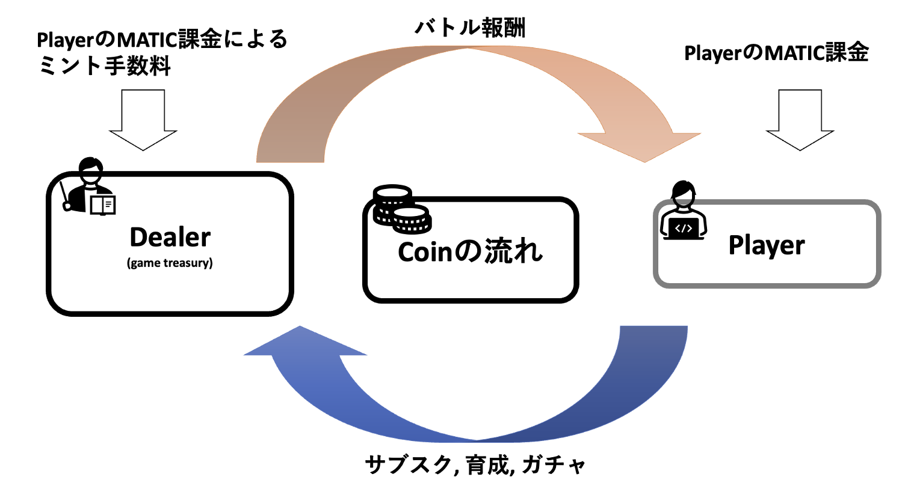

ゲームの要素とその実現方法について

<[前のページに戻る](./31_character.md)>

 < [HOMEに戻る](../../README.md)   >
___
# ゲーム内硬貨（PLMCoin）とトークノミクス
PLMCoinはERC20トークンとして実装されています。

### 用途
PLM Coin は、ガチャ（NFT獲得）、キャラクター育成、サブスクリプションに使用します。

### 入手
プレイヤーはMATICを一定額支払う課金か、ゲームに勝利することでPLMCoinを報酬として入手することが可能です。

### 発行
初期ミントを除いたPLMCoinの発行は課金が実行された際に行われます。1 MATICに対して 1 PLMCoin が発行されますが、プレイヤーが受け取るPLMCoinは、発行分から手数料（ゲームコントラクトが受領）を除いた分です。

### PLMCoinの流れ
ゲームの勝利報酬はゲームコントラクトの残高より支払われます。

外部からの資金流入はプレイヤー課金で、プレイヤーにとってのPLM Coin収入源はバトル報酬のみとなっています。

現時点では、pay to win を抑止するため、累進課税のような形で手数料が課金額に対応して増額される機構を導入しています。今後のアップデートで、ゲームバランスの調整により、free to win な構成にシフトしていく予定です。

  

---
- [次を読む ](./33_gacha.md)

- [HOMEに戻る](../../README.md) 
