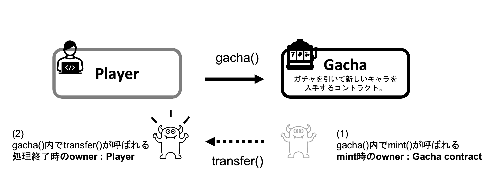

ゲームの要素とその実現方法について

<[前のページに戻る](./32_coin.md)>

 < [HOMEに戻る](../../README.md)   >
___
# ガチャ

プレイヤーはPLMCoinを支払うことでキャラクター (PLMToken) をミントするガチャを回すことができます。

ガチャではミントをPLMGacha コントラクトが実行しそれをプレイヤーにtransferする形で実装されています。

これにより、そのキャラクターの最初の所有者としてゲームコントラクトアドレスが記録されるので、**そのPLM Tokenが公式のものであることが証明されます。**（これはNouns DAO ([https://nouns.wtf/](https://nouns.wtf/)) でTokenがオークションにかけられる際に一度 AuctionHouse Contract がミントを実行してから落札者にtransferされる実装に影響を受けています。）
  

  
## ミント時のランダム性
ミント時にキャラクター画像ID、属性、特性がランダムに決定します。キャラクター画像はオフチェーンに保存したものからランダムに選択され、特性はその効果によってレア度が1ー5まで存在し、レア度に応じた排出率となっています。

**今回乱数の発生にはChainLinkといった別途手数料のかかるオラクルは使用していません。代わりにコントラクト内にて疑似乱数の生成を行っています。その時点まで予測することが困難な最新のブロックハッシュをハッシュ関数に入力して乱数を生成することで、乱数調整を困難にしています。**(これはwhelps NFT ([https://whelps.io/](https://whelps.io/)) などで使用されている、スマートコントラクト内で検証可能な疑似乱数を発生させる方法に影響を受けています。) 

  

---
- [次を読む ](./34_stamina.md)

- [HOMEに戻る](../../README.md) 
