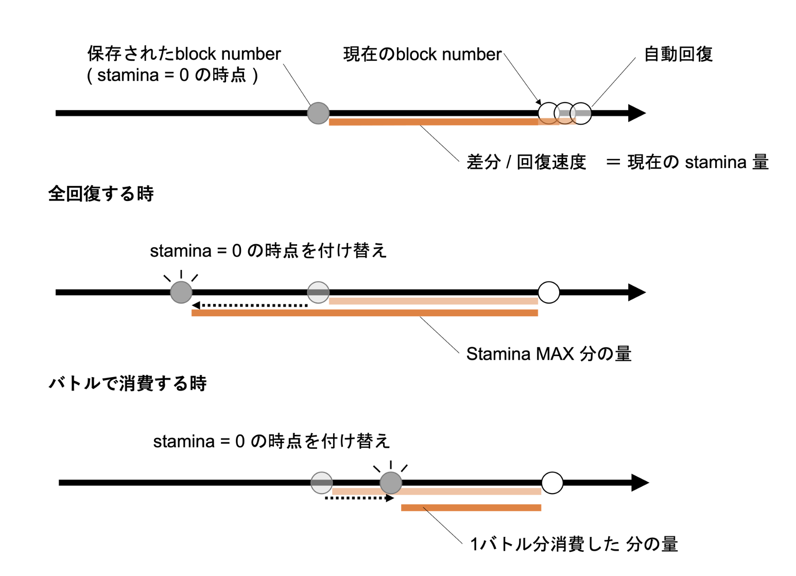

ゲームの要素とその実現方法について

<[前のページに戻る](./33_commit-reveal.md)>

 < [HOMEに戻る](../../README.md)   >
___

# スタミナ
プレイヤーはバトルを開始するためにスタミナを一定数消費する必要があります。スタミナは最大値が定められており、消費すると一定速度で回復していきます。また、PLMCoinを使用して全回復することも可能です。

ガス代を削減するため、ブロックチェーン上で保持した値の書き換えはできる限り少なくすることが望ましいです。そこで、各playerのスタミナがゼロであった時点のblock numberを保持し、現時点のスタミナを回復速度から計算する実装としました。スタミナを消費・全回復は保存したblock numberを書き換えることで実現でき、データの書き換え回数を抑えることができます。

# サブスクリプション

プレイヤーがゲームに参加するにはサブスクリプションを行う必要があります。PLMCoinを一定数支払うことで、1296000ブロック時間遊ぶことができるようになります。サブスクはplayerごとの期限切れとなるblock numberを保持することで管理しています。

  

---
- [次を読む ](./35_matchmaking.md)

- [HOMEに戻る](../../README.md)
