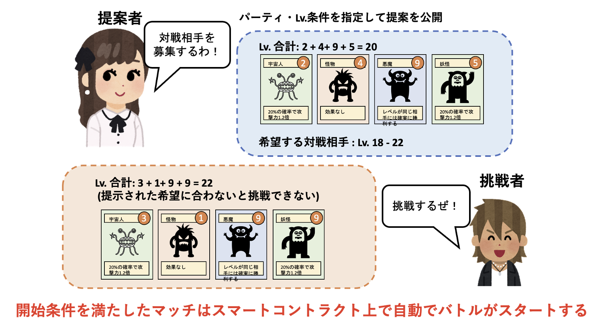

ゲームの要素とその実現方法について

<[前のページに戻る](./34_stamina.md)>

 < [HOMEに戻る](../../README.md)   >
___

# マッチメイキング

## decentralized autonomous matching
サーバを使用することなくかつ autonomous に2人のプレイヤーのマッチメイクをする場合は、バトルを後からリクエストした方のトランザクションをトリガーとしてバトルをスタートさせる必要があります。そこで、マッチメイク時のプレイヤーの役割を提案者・挑戦者を分けて実装することで、autonomousなマッチメイクを実現しました。

Playerはバトルをする方法は2通りあります。1. バトルを提案して挑戦者を待つ  2. 提案されているバトルに挑戦する の2つです。バトルを提案する側は使用するキャラクターを4体のパーティを組んで提案を作成し、挑戦者を待ちます。この時、バトルを希望する相手のレベル範囲を指定することが可能です。

挑戦する側は、現存している提案のパーティ情報を参照しながら挑戦したい提案を選びます。挑戦したい提案を選び、自分のキャラクターから4体のパーティを組んでバトルをリクエストします。この時、パーティの合計レベルが提案で指定された範囲にする必要があります。

挑戦リクエストが条件を満たしているとバトルに入る処理が呼ばれ、バトルに関するコントラクトが実行可能となり、自動的にバトルに遷移します。

  

---
- [次を読む](./36_battlesystem.md)

- [HOMEに戻る](../../README.md)
