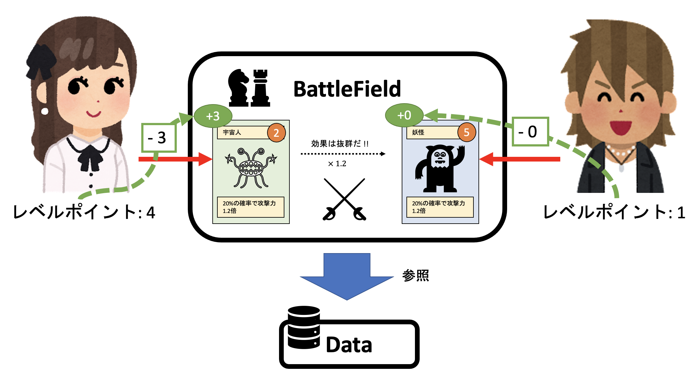

バトルシステム

<[前のページに戻る](./35_matchmaking.md)>

 < [HOMEに戻る](../../README.md)   >
___
## バトルシステム概要
1ゲーム 1on1 のPvPで、5ラウンド戦い、勝利ラウンド数の大きい方がバトルに勝利します。

プレイヤーはゲーム開始時に自分の所有するキャラの中から選んだ４体からなるパーティーに加え、図鑑に存在するすべてのキャラからランダムに一体選ばれたキャラがランダムスロットに入れられ、合計5体でバトルを開始します。ゲーム開始と同時に、プレイヤーにはレベルポイントと呼ばれるポイントが与えられ、一バトルの中でプレイヤーはキャラを戦いに出す際にレベルポイント分だけレベルを加算することができるようになります。レベルポイントは POLYLEMMA において読み合いを増やすために導入した要素です。双方のキャラが出揃うと、そのキャラのレベル + 付与されたレベルポイントをベースとして、属性の相性とキャラクターの持つと癖が加味されてダメー計算が行われ、勝敗が決まります。これらのロジックはスマートコントラクトに書かれています。

ゲームの性質上、キャラクターには相性というものがあるので、相手の出したキャラクターを見てからキャラクターを出すとジャンケンの後出しのように簡単に勝ててしまいます。そのため、コマンドを同時に出す必要があります。ところが、POLYLEMMA はフルオンチェーンゲームなので、**コマンドを同時に出す時に”同時”を保証することが困難です。POLYLEMMA では Commit-Reveal Scheme を使うことで “同時”と同等の処理を実現しました。**

  

---
- [次を読む ](./37_command.md)

- [HOMEに戻る](../../README.md)
