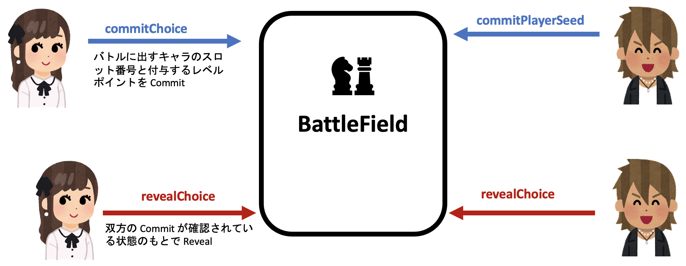

バトルシステム

<[前のページに戻る](./36_battlesystem.md)>

 < [HOMEに戻る](../../README.md)  >
___

# Commit-Reveal Schemeを用いてオンチェーンで同期を実現したコマンドバトル]

コマンドを出すときは、相手の手を見てから自分の手を出せないよう、自分の出すキャラクターのスロット番号 $ i$ と、付与するレベルポイント $lp$ を、blindingFactor という追加の乱数を使って暗号化して暗号文 $h(i,lp,blindingFactor)$ スマートコントラクトに送ります (Commit)。Commit-Reveal Scheme の持つ Hiding の性質により、両者は相手の選択をこの時点では除くことができません。また、選択を変更することも Commit-Reveal Scheme の持つ Binding の性質によりばれずにはできません。両者の Commit が確認された後、それぞれのプレイヤーは Reveal を行います。具体的には $i,lp,blindingFactor$
 を公開することでオンチェーンに記録された Commit String とハッシュが一致するかどうかを持って検証を行います。検証が通れば、自動的にキャラの戦闘が行われ、結果が返されます。ここでそのラウンドは終了です。まだ勝敗がついていない場合は、自動的に次のラウンドに移行します。そこには運営主体がありません。

ここからは、起こりうる不正行為とそれぞれへの対処の仕方を述べます。細々とした話になるので、興味のない方は飛ばしても構いません。

- 遅延行為
    
    いつまで経っても Commit しない、いつまで経っても Reveal しないことでいつまで経ってもバトルが進行しないという遅延行為が考えられます。そのため、我々は一方が普通のユーザー、片方が遅延行為を働くユーザーであるという状況のもとで、次のような対処方法を考えました。
    
    具体的には、Commit をする時間が始まった時のチェーンのブロック番号を記載しておき、特定の時間 (ブロック数で指定) が過ぎても相手がまだ Commit してこなかった場合、普通のユーザー側が待ちきれなくて Reveal を行うと相手のユーザーがコミット時間切れとなってバトルがキャンセルされ、遅延行為を働いたユーザーにはサブスクリプション期間の一部没収という罰則が与えられます。そして、迷惑を被った普通のユーザーにはそのバトルをするために消費したスタミナを返却するという処理を行います。
    
    Reveal の場合にも似たような対処を施しています。これにより、どちらかが普通の (悪意のない) プレイヤーの場合は一生バトルが終わらないという状況を運営主体なしでも***自動で***防ぐことができます。また、不正行為認定をされた方も、自分の不正行為の証拠がオンチェーンに誰でも見える形で残っているので、運営の意思を介さない平等な不正ユーザーの摘発及び罰則の付与が可能です。
    
- ルール違反
    
    このゲームは一度バトルに出したキャラは次以降のラウンドでは使えないので、使用済みのキャラを使おうとしたらルール違反です。他にもレベルポイントの上限を突破してレベルポイントを付加しようとする行為もルール違反です。Reveal の段階でルール違反は発覚しますが、発覚してもルール違反をする前には戻せません。そのため、遅延行為と同じようにサブスクリプション期間の一部没収という罰を与えてバトルをキャンセルし、被害を受けたプレイヤーにはスタミナを返却します。では、ルール違反を行ったユーザーがバレないためにいつまで経っても Reveal を行わなければ遅延行為として処理されますし、ルール違反を隠すために過去の Commit を覆そうとしても Binding の性質によってバレてしまいます。よって、上記のように自動かつ証拠付きの公平な判断基準による不正ユーザーの摘発及び罰則の付与が可能です。
    
- どちらも悪意のあるプレイヤーの場合はどうするか？
    
    双方が一生バトルを進行せず不正を隠そうとすると、バトルが完全に停止します。もし対戦の部屋が複数あればその部屋は放置しておき新しい部屋を作れば良いです。対戦部屋が一つしかない場合、これは問題になります。今回はハッカソン期間内に複数の対戦部屋の実装まで至らなかったため、新しいマッチングが起きた時に、現在対戦部屋が空いていない場合、Commit/Reveal しないといけないのにどちらもしておらず Commit/Reveal の制限時間を超過していることは判定可能です。その条件が満たされた時に現在の対戦部屋で行われているバトルを強制終了して双方に罰則を与え、部屋を開けるという処理が可能です。時間の都合上今回は実装できていませんが、今後のバージョンでの追加を検討しています。
    

以上が Commit-Reveal Scheme を用いた、コマンドを同時に出す仕組みです。POLYLEMA ではもう一つランダムスロット (5体目のモンスターです) という要素を実現していますので、次にそれについて説明していきます。

  

---
- [次を読む ](./38_randomslot.md)

- [HOMEに戻る](../../README.md)
