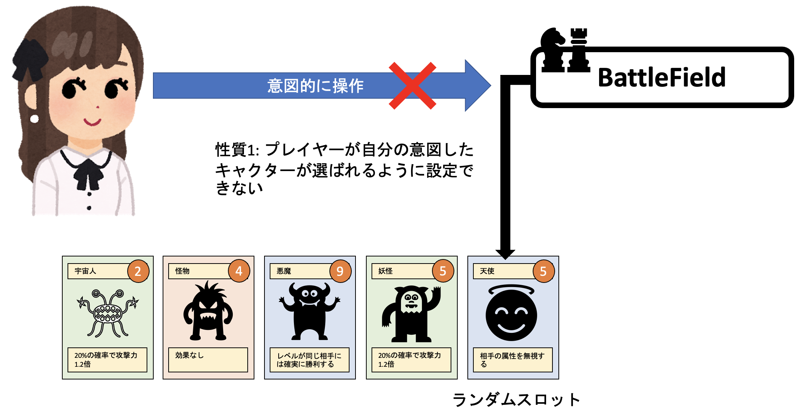
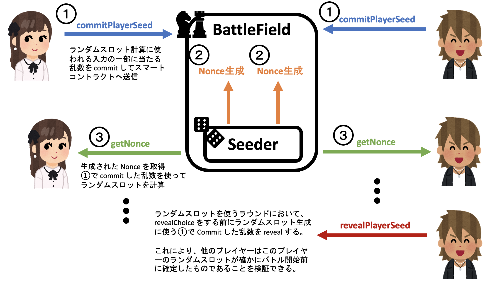

バトルシステム

<[前のページに戻る](./37_command.md)>

 < [HOMEに戻る](../../README.md)  >
___
### 考案したプロトコルを使用した"ランダムスロット"

ランダムスロットは POLYLEMMA にあるゲーム性を高めてゲームを面白くする要素の一つです。ランダムスロットは、***性質1: 自分で意図的に特定のキャラを指定することができない(ランダムに生成されているように見える)*** かつ ***性質2: そのキャラをラウンドでの戦いに出すまでは相手は何のキャラがランダムスロットに入れたれたのかを知ることはできない*** という二つの要素を満たします。ブロックチェーンではトランザクションの履歴が公開される都合上、透明性は担保されますが、逆にこういった相手から “隠す” という要素の実現が難しくなります。以下でランダムスロットをどう実現したかを説明してきます。
  
  

  
***ここからランダムスロットの実現方法の説明に入ります。少々込み入った内容にはなりますが、今回のプロジェクトの核となる技術要素のため、ぜひ読んでいただきたい部分です。***
  

性質1を愚直に満たそうとするなら、ゲームを執り行うコントラクトからプレイヤーに乱数を配布するという方法が考えられます。その乱数 $r$ をハッシュ関数 $h$ に通して、図鑑にあるキャラクターの総数 $n$ で剰余を取ることでランダムスロットに選ばれるキャラクターの番号 $id$ は

$$
id = h(r)\mod\ n
$$

で定義すれば良いでしょう。ところが、この方法では性質2が満たされないことがすぐにわかります。というのも、スマートコントラクトからユーザーに乱数を配った場合、それは当然トランザクションとして実行されるわけですから、相手からも丸見えになります。そのため、相手が自分のランダムスロットを定義するために発行された乱数を覗き見して、手元で上記の計算式を回せば、ランダムスロットの中身を図鑑から取得できてしまいます。よって、この方法はダメです。

次に、性質2から満たそうとしてみましょう。自分にだけ見えて、相手には見えないようにするには、愚直に Commit-Reveal Scheme を使うと良さそうです。まずは自分の手元で秘密の乱数 $s$ を発行し、$id=h(s)\ mod\ n$ でランダムスロットに割り当てられる番号を知ったのちに、相手にはバレないようにスマートコントラクトには別のハッシュ関数 $h'$ を用いて計算した $s$ の暗号文 $h'(s)$ を送信します (Commit-Reveal Scheme の Commit)。すると、相手からは $h'(s)$ は丸見えですが、ハッシュの原像困難性により、相手は暗号化されている元の秘密の乱数 $s$ を知ることはできません (Commit-Reveal Scheme の Hiding)。そのため、ランダムスロットの中身もわからなくなり、確かに性質2は満たされています。そして、後から自分は確かに秘密の乱数 $s$ を持っていたと証明 (Commit-Reveal Scheme の Reveal) できますし、別の乱数を持っていたと嘘をつくこともできません(Commit-Reveal Scheme の Binding)。ところが、性質1は満たされていません。というのも、秘密の乱数 $s$ を使うと $id$ で指定される図鑑のモンスターをランダムスロットに持ってこれることを自分はわかってしまうからです。そのため、もし過去に一度でも強いモンスターを引くことができる秘密の乱数 $s$ を知ってしまうと、何度でもその乱数を使用することで強いモンスターを意図的にランダムスロットに引き続けることができてしまいます。よって、この方法もダメです。***Commit-Reveal Scheme をそのまま適用するだけではランダムスロットの実現はできません。***

では、どうすれば良いのでしょうか？今回我々は Commit-Reveal Scheme を応用することで性質1と性質2を同時に満たすプロトコルを考案し、実際に POLYLEMMA に実装を行いました。そのプロトコルを紹介します。

ランダムスロットの計算方法を以下にします。$s$ は先ほどと同じくプレイヤーが秘密にしておく乱数です。$nonce$ はゲームから配布される乱数です。ランダムスロットをプレイヤーの持つ乱数とゲームの持つ乱数の二つを使って定義するということです。

$$
id=h(s,nonce)\mod\ n
$$

プロトコルは次のように進行します。プレイヤーはまず自分の乱数 $s$ を手元で作り、ハッシュ関数 $h'$ (おそらく $h$ でも良い) を使ってそれを暗号化して暗号文 $h'(s)$ を作り (Commit-Reveal Scheme の Commit に対応)、ゲームのスマートコントラクトに送ります。ゲームは暗号文を暗号文を受理したことを確認した後に、$nonce$ を返します。これにより入力が揃うので、プレイヤーは自分のランダムスロットにどのキャラクターが割り当てられるかを知ることがでいます。このプロトコルは、メッセージを送る順番が非常に重要です。
  
  

  
  
それでは、このシンプルなプロトコルが確かに性質1と性質2の両方を満たしていることを確認していきましょう。

性質1ですが、まずプレイヤーが $s$ を確定する前の時点ではプレイヤーは $nonce$ を知りません。手元でどれだけたくさんの $s$ の候補を試そして特定の番号を引き当てようとしても、$nonce$ 次第で結果が変わってしまうので無理です。$nonce$ がものすごく短ければ、総当たりで試して、強い番号を引く確率が高い $s$ を選択できなくもないですが、$nonce$ が長くなれば、もはや不可能です。いずれにしろ、この方式ではプレイヤーは何も考えずに適当に $s$ を作る以上に意味のある行動を取れません。確かに性質1が満たされています。

では性質2はどうでしょうか？相手から見ると、プレイヤーの秘密の乱数はハッシュ関数で暗号化されており、$h'(s)$ しか見えていません。ゲームが送った $nonce$ は見えていますが、ハッシュの原像困難性により秘密の乱数 $s$ がわからない (Commit-Reveal Scheme の Hiding) ので入力の一部が欠けた状態で ハッシュ値の予測をせざるを得ず、秘密の乱数 $s$ が十分に長ければ総当たりで試すこともできません。性質2も満たされています。

ランダムスロットを出す場合は普通のバトルの Commit-Reveal において、Reveal の直前に Commit していた秘密の乱数 $s$ を Reveal によって公開することで他のプレイヤーが、確かに今から Reveal されるランダムスロットに割り当てられているキャラクターは、ゲーム開始時に確定したものと一致することを検証できるのです。

  

---
- [次を読む ](./39_reward.md)

- [HOMEに戻る](../../README.md)
